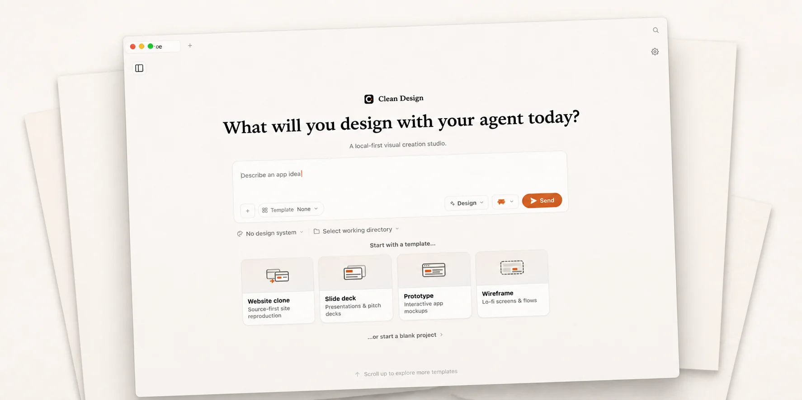

<h1 align="center">Clean Design</h1>

<p align="center"><b>English</b> · <a href="docs/i18n/README.zh-CN.md">简体中文</a></p>

<p align="center">
  <strong>A local-first visual creation studio powered by the AI tools you already use.</strong>
</p>

<p align="center">
  <a href="https://github.com/nxxxsooo/clean-design/releases/latest"></a>
  <a href="#download"></a>
  <a href="LICENSE"></a>
  <a href="PRIVACY.md"></a>
</p>



<p align="center">
  <a href="https://github.com/nxxxsooo/clean-design/releases/latest"><b>Download for Apple Silicon Mac →</b></a>
</p>

Clean Design turns a prompt into an editable visual project on your Mac. Use an existing local AI CLI or your own model-provider key, refine the result on the canvas, inspect its files, and export a portable handoff.

- Local projects, assets, history, and exports
- No Clean Design account, subscription, telemetry, or automatic updater
- BYOK providers configured separately inside the app

## Bring your own agent

Clean Design generates through a local CLI you already have installed. No additional AI subscription is required.

| Runtime | Detected command |
|---|---|
| Codex | `codex` |
| Claude Code | `claude` |
| Antigravity | `agy` |
| OpenCode | `opencode-cli`, falling back to `opencode` |
| Pi | `pi` |

Prefer an API key instead? Configure a BYOK provider inside the app.

## What you can make

Prototypes · Decks · Documents · Design systems · Brand kits · Images · Video · Audio


Every artifact stays a real project on disk: editable on the canvas, inspectable as files, and exportable as a handoff packet.

## Download

Clean Design is built for Apple Silicon Macs. Download the DMG or ZIP and `SHA256SUMS.txt` from the matching [GitHub Release](https://github.com/nxxxsooo/clean-design/releases).

Verify the files before opening the app:

```bash
shasum -a 256 -c SHA256SUMS.txt
```

Open the DMG and copy `Clean Design.app` to `/Applications`. The v0.1.0 build is ad-hoc signed but not Apple-notarized, so Gatekeeper may ask for confirmation. After verifying the download, Control-click the app and choose **Open**. If macOS still blocks it:

```bash
xattr -dr com.apple.quarantine "/Applications/Clean Design.app"
```

Updates are manual: quit Clean Design and replace the application. Projects and settings are stored separately and remain in place.

## How it works


```text
Describe -> generate -> visually refine -> export
```

Clean Design keeps each visual project editable. You can work with previews and canvas tools, manage assets and themes, maintain `DESIGN.md`, and create an immutable handoff packet containing the project files, manifest, design context, and available previews.

## Develop locally

Requirements: Apple Silicon macOS, Node.js 24, and pnpm 10.33.2.

```bash
pnpm install
pnpm guard
pnpm typecheck
pnpm tools-dev run web
```

Build and install the macOS application:

```bash
pnpm tools-pack mac build --to all --portable
pnpm tools-pack mac install
```

Clean Design does not install a global CLI.

## Privacy

The local service binds to loopback and preserves authenticated local IPC boundaries. Network requests occur only for the provider you select, the behavior of a local CLI you invoke, or a resource you explicitly request. See [PRIVACY.md](PRIVACY.md).

## Provenance and license

Clean Design is an independent project derived from an upstream codebase; the upstream project does not sponsor or endorse this fork. Internal `@open-design/*` package scopes and `OD_*` development variables remain for source compatibility. See [NOTICE](NOTICE) and [UPSTREAM.md](UPSTREAM.md) for attribution.

Licensed under the [Apache License 2.0](LICENSE).
