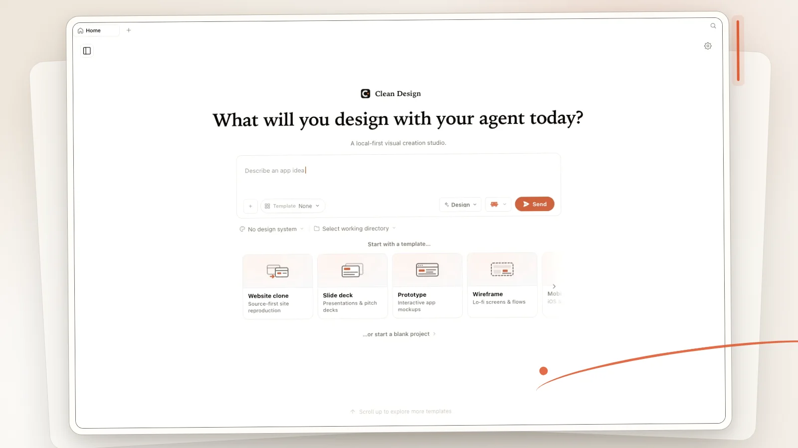
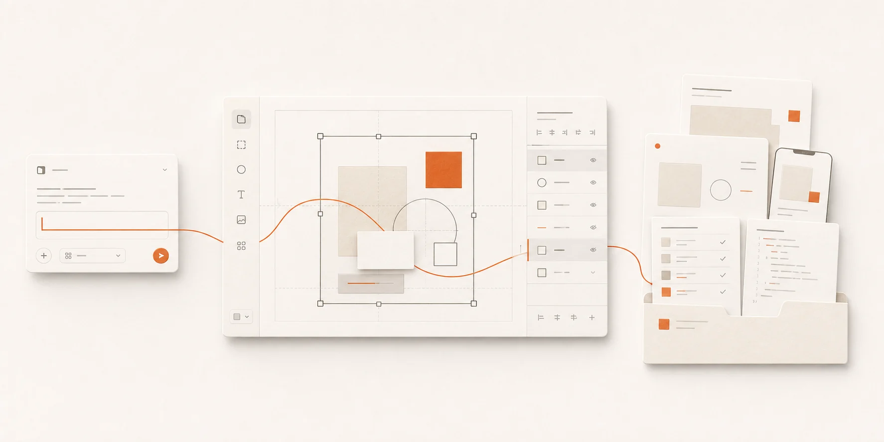
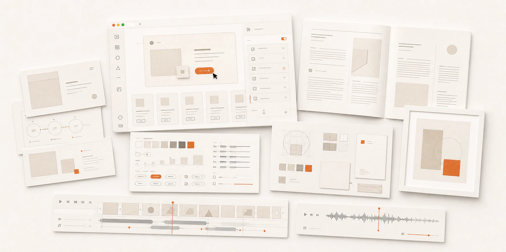

<h1 align="center">Clean Design</h1>

<p align="center"><b>English</b> · <a href="docs/i18n/README.zh-CN.md">简体中文</a></p>

<p align="center">
  <strong>Your agent can make. Your Mac keeps the work.</strong><br>
  A local-first visual creation studio powered by the AI tools you already use.
</p>

<p align="center">
  <a href="https://github.com/nxxxsooo/clean-design/releases/latest"></a>
  <a href="#download"></a>
  <a href="PRIVACY.md"></a>
</p>

<p align="center">
  <a href="https://github.com/nxxxsooo/clean-design/releases/latest"></a>
</p>



Clean Design turns a prompt into a real visual project on your Mac. Generate with a supported local AI CLI or your own model-provider key, refine the result on the canvas, inspect its files, and export a portable handoff.

- **Use the AI you already have.** Bring Codex, Claude Code, Antigravity, OpenCode, Pi, or a separately configured BYOK provider.
- **Keep real, editable projects.** Projects, assets, history, themes, previews, and `DESIGN.md` remain useful beyond one generation.
- **Carry the work forward.** Export an immutable handoff containing project files, design context, a manifest, and available previews.

## Bring your own agent



Clean Design generates through a local CLI you already have installed. No additional Clean Design account or AI subscription is required.

| Runtime | Detected command |
|---|---|
| Codex | `codex` |
| Claude Code | `claude` |
| Antigravity | `agy` |
| OpenCode | `opencode-cli`, falling back to `opencode` |
| Pi | `pi` |

Prefer an API key instead? Configure a BYOK provider separately inside the app.

## Make more than screens



**Prototypes · Slide decks · Documents · Design systems · Brand kits · Images · Video · Audio**

Every artifact stays a project on disk: editable on the canvas, inspectable as files, and exportable as a handoff rather than trapped inside a hosted workspace.

## Local by default

- Projects, assets, history, settings, and exports stay on your Mac.
- There is no Clean Design account, subscription, hosted workspace, product telemetry, or automatic updater.
- Local HTTP services bind to loopback and preserve authenticated local IPC boundaries.
- Network requests occur only for the provider you select, the behavior of a local CLI you invoke, or a resource you explicitly request.

See [PRIVACY.md](PRIVACY.md) for the complete boundary.

## Download

Clean Design is built for Apple Silicon Macs. Download the DMG or ZIP and `SHA256SUMS.txt` from the matching [GitHub Release](https://github.com/nxxxsooo/clean-design/releases).

Verify the files before opening the app:

```bash
shasum -a 256 -c SHA256SUMS.txt
```

> [!IMPORTANT]
> Clean Design v0.1.0 is ad-hoc signed but not Apple-notarized. After verifying the download, open the DMG, move `Clean Design.app` to `/Applications`, then Control-click the app and choose **Open** if Gatekeeper asks for confirmation.

If macOS still blocks the verified app:

```bash
xattr -dr com.apple.quarantine "/Applications/Clean Design.app"
```

Updates are manual: quit Clean Design and replace the application. Projects and settings are stored separately and remain in place.

## Develop locally

Requirements: Apple Silicon macOS, Node.js 24, and pnpm 10.33.2.

```bash
pnpm install
pnpm guard
pnpm typecheck
pnpm tools-dev run web
```

Build and install the macOS application:

```bash
pnpm tools-pack mac build --to all --portable
pnpm tools-pack mac install
```

Clean Design does not install a global CLI.

## Provenance and license

Clean Design is an independent project derived from an upstream codebase; the upstream project does not sponsor or endorse this fork. Internal `@open-design/*` package scopes and `OD_*` development variables remain for source compatibility. See [NOTICE](NOTICE) and [UPSTREAM.md](UPSTREAM.md) for attribution.

Licensed under the [Apache License 2.0](LICENSE).
