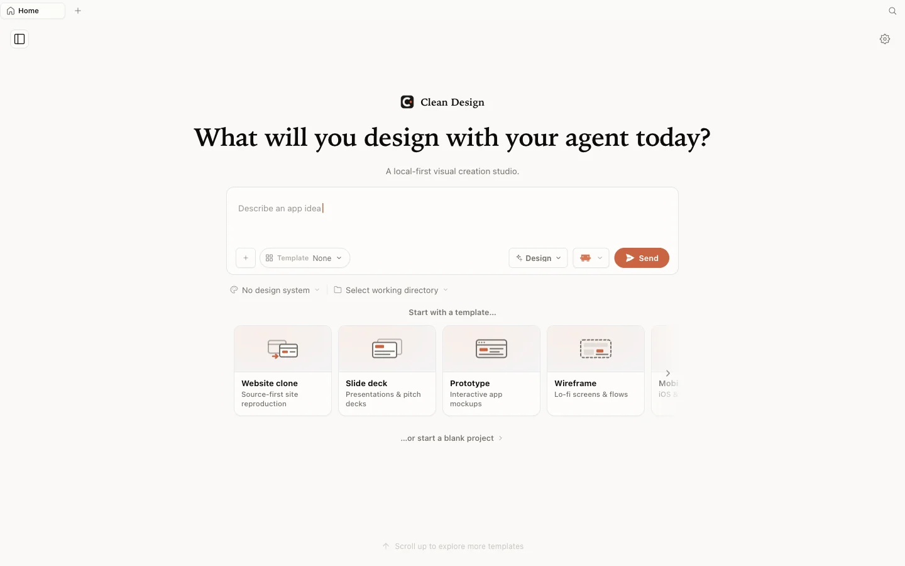

<h1 align="center">Clean Design</h1>

<p align="center"><a href="../../README.md">English</a> · <b>简体中文</b></p>

<p align="center">
  <strong>本地优先的视觉创作工作室，直接使用你已经在用的 AI 工具。</strong>
</p>

<p align="center">
  <a href="https://github.com/nxxxsooo/clean-design/releases/latest"></a>
  <a href="#下载"></a>
  <a href="../../LICENSE"></a>
  <a href="../../PRIVACY.md"></a>
</p>



<p align="center">
  <a href="https://github.com/nxxxsooo/clean-design/releases/latest"><b>下载 Apple 芯片 Mac 版本 →</b></a>
</p>

Clean Design 把一句想法变成 Mac 上可继续编辑的视觉项目。你可以使用已有的本地 AI CLI 或自己的模型提供商密钥，在画布上持续打磨，检查项目文件，并导出可移交的完整成果。

- 项目、素材、历史和导出文件都保存在本地
- 无需 Clean Design 账户、订阅，不含产品遥测和自动更新
- BYOK 模型提供商在应用内单独配置

## 使用你自己的智能体

Clean Design 通过你本机已经安装的 CLI 生成内容，不需要额外购买 AI 订阅。

| 运行时 | 检测到的命令 |
|---|---|
| Codex | `codex` |
| Claude Code | `claude` |
| Antigravity | `agy` |
| OpenCode | `opencode-cli`，回退到 `opencode` |
| Pi | `pi` |

更习惯直接用 API 密钥？可以在应用内配置 BYOK 模型提供商。

## 可以做什么

原型 · 演示文稿 · 文档 · 设计系统 · 品牌套件 · 图像 · 视频 · 音频

每一件作品都是磁盘上真实存在的项目：可以在画布上继续编辑，可以按文件检查，也可以导出成完整的移交包。

## 下载

Clean Design 面向 Apple 芯片 Mac。请从对应的 [GitHub Release](https://github.com/nxxxsooo/clean-design/releases) 下载 DMG 或 ZIP，以及 `SHA256SUMS.txt`。

打开应用前先校验文件：

```bash
shasum -a 256 -c SHA256SUMS.txt
```

打开 DMG，将 `Clean Design.app` 复制到 `/Applications`。v0.1.0 使用临时签名，但没有经过 Apple 公证，因此 Gatekeeper 可能要求确认。校验下载来源后，请按住 Control 点按应用并选择「打开」。如果 macOS 仍然拦截：

```bash
xattr -dr com.apple.quarantine "/Applications/Clean Design.app"
```

版本更新需要手动完成：退出 Clean Design 后替换应用即可。项目和设置保存在单独的位置，不会随应用替换而消失。

## 工作方式

```text
描述想法 -> 生成 -> 视觉打磨 -> 导出
```

Clean Design 让每个视觉项目保持可编辑。你可以使用预览和画布工具，管理素材与主题，维护 `DESIGN.md`，并生成不可变的项目移交包，其中包含项目文件、清单、设计上下文和可用预览。

## 本地开发

环境要求：Apple 芯片 macOS、Node.js 24、pnpm 10.33.2。

```bash
pnpm install
pnpm guard
pnpm typecheck
pnpm tools-dev run web
```

构建并安装 macOS 应用：

```bash
pnpm tools-pack mac build --to all --portable
pnpm tools-pack mac install
```

Clean Design 不会安装全局 CLI。

## 隐私

本地服务只监听回环地址，并保留经过认证的本地 IPC 边界。只有在你选择模型提供商、明确调用本地 CLI，或主动请求某项资源时，应用才会产生相应网络请求。详见 [PRIVACY.md](../../PRIVACY.md)。

## 来源与许可证

Clean Design 是基于上游代码独立开发的项目；上游项目不赞助，也不为本分支背书。内部 `@open-design/*` 包名和 `OD_*` 开发变量暂时保留，用于源码兼容。具体来源与署名见 [NOTICE](../../NOTICE) 和 [UPSTREAM.md](../../UPSTREAM.md)。

项目使用 [Apache License 2.0](../../LICENSE)。
