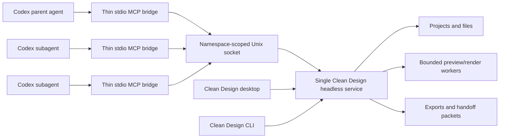

# Clean Design Codex Plugin and Headless Service

**Status:** Approved design, pending written review  
**Date:** 2026-08-10

## Summary

Clean Design will ship a manually installable, repository-owned Codex plugin named `clean-design`. The plugin combines a small set of Codex guidance skills with an MCP bridge. The bridge automatically connects every parent agent and subagent to one bounded, authenticated, local Clean Design service per data namespace.

The service may run without the desktop application, but MCP is not a general agent-hosting surface. An MCP-authenticated session performs deterministic project, file, design-system, preview, render, and export operations only. No MCP-originated operation can start Codex, invoke another model, or spawn another coding agent. A separately authenticated desktop session may retain the product's existing generation runtime without making it reachable from MCP. This boundary prevents recursive agent creation while still letting the current Codex agent use Clean Design as a local visual-creation service.

## Goals

- Replace the stale Open Design plugin identity with a tracked, first-party Clean Design plugin.
- Let a user install the plugin manually from this project and use it without opening the desktop app.
- Auto-start one local service and make all Codex agents and subagents share it.
- Guide the current Codex agent with skills while MCP supplies bounded project and rendering capabilities.
- Preserve Clean Design namespace isolation, trusted-root containment, secret handling, and loopback-only operation.
- Support both a source checkout and an installed Clean Design app without installing a global `od` command.
- Fail predictably under concurrency, overload, crashes, stale state, or incompatible versions.

## Non-goals

- Publishing a hosted or public Codex catalog plugin in this change.
- Restoring Open Design Cloud, accounts, collaboration, deployment, telemetry, updates, or external plugin hosting.
- Installing a global CLI or permanent login/background service.
- Allowing MCP tools to execute arbitrary shell commands, invoke providers, run coding agents, or access arbitrary filesystem roots.
- Advertising every bundled Clean Design workflow as a separate top-level Codex skill.
- Supporting destructive project deletion through MCP in the first version.

## Product-contract change

The current Clean Design contract prohibits headless bootstrap and downstream-agent MCP integration. This feature deliberately narrows that prohibition:

- A first-party `clean-design` plugin may start the Clean Design service headlessly when the user explicitly invokes the installed MCP plugin or Clean Design CLI.
- The process remains local, namespace-isolated, authenticated, bounded, and temporary.
- This exception does not permit third-party plugin hosts, hosted services, global CLI installation, silent login-time startup, or agent spawning from the service.
- Existing product documentation, OpenSpec requirements, and acceptance tests must be updated together so the exception is explicit rather than an undocumented regression.

## Architecture



### 1. Repository-owned Codex plugin

The repository will track a native Codex marketplace and plugin named `clean-design`. The plugin owns:

- `.codex-plugin/plugin.json` with Clean Design identity and metadata.
- `.mcp.json` pointing to the plugin-owned stdio launcher.
- A router skill and curated artifact-family skills.
- The small launcher/bridge needed to locate, start, and connect to the service.
- Marketplace metadata that lets another user manually add and install the plugin from this project.

The stale ignored `.claude-plugin/marketplace.json` and `plugins/open-design` MCP manifests are upstream residue. They will be removed or replaced so Codex no longer discovers an Open Design entry from this working tree.

The first version remains a project-distributed plugin. Public catalog publication is a separate future decision.

### 2. Skill distribution

The plugin exposes:

- One `clean-design` router skill that selects the artifact workflow and defines the MCP safety contract.
- Curated wrapper skills for prototypes, decks, images, video, and documents.
- MCP `list_skills` and `read_skill` tools for the complete Clean Design catalog.

The wrappers stay small and delegate detailed workflow content to the canonical catalog returned by the service. This avoids duplicating or advertising more than 160 repository skills while preserving access to all workflows.

Skills instruct the current Codex agent to do the reasoning and authoring. They never instruct the service to create another agent.

### 3. Thin stdio bridge

Each Codex session may instantiate its own lightweight stdio MCP bridge. The bridge does not load project databases, browsers, renderers, or agent runtimes. It only:

1. Resolves the Clean Design namespace and stable local socket.
2. Connects to a compatible running service when present.
3. Coordinates singleton startup when the socket is unavailable.
4. Authenticates and forwards MCP JSON-RPC messages.
5. Maintains a client lease until stdio closes.

The launcher resolves a protocol-compatible service executable in this order:

1. The current source checkout's built development service when the installed plugin belongs to that checkout.
2. The installed Clean Design application bundle.

It does not fall back to `od`, Open Design runtime paths, or an arbitrary executable from `PATH`.

### 4. Singleton service and endpoint

Each Clean Design data namespace has one stable discovery endpoint:

```text
/tmp/clean-design/ipc/<namespace>/service.sock
```

The namespace is derived from privileged installation/data-root metadata, not from a TCP port or an untrusted project mutation. It keeps source, packaged, test, and future side-by-side installations isolated.

Startup follows a connect-lock-recheck-start sequence:

1. Attempt the Unix socket.
2. If unavailable, acquire an atomic namespace startup lock.
3. Recheck the socket after acquiring the lock.
4. Start one service only if it is still absent.
5. Publish a permission-restricted process stamp after readiness.
6. Release the lock; losing contenders wait with bounded backoff and attach.

The process stamp records the PID, executable/version fingerprint, namespace, data-root fingerprint, dynamic internal HTTP port when applicable, start time, and authentication material reference. A stale PID, mismatched executable, or incompatible protocol version is never treated as a valid service.

Internal loopback HTTP ports remain dynamic transport details. The Unix socket and namespace are the stable identity.

### 5. Authentication and secrets

- The runtime directory and Unix socket are owner-only.
- Startup creates a random 256-bit secret in a mode-`0600` runtime file.
- The bridge and service use that secret for a challenge-response handshake and derive an ephemeral session key.
- A readable stale process stamp without the matching secret cannot authenticate.
- MCP-authenticated sessions cannot read provider credentials and do not invoke providers.
- Desktop-managed provider credentials remain in Electron `safeStorage` and are not copied into the headless runtime.
- Logs never include authorization values, decrypted secrets, prompts, file contents, or provider headers.

### 6. MCP capability surface

The first version exposes a small allowlisted surface:

- Service: health, version, namespace, and capacity information.
- Projects: list, inspect, create, and open by project identifier.
- Files: list, read, and atomically write within a project; no arbitrary host paths.
- Design: read active `DESIGN.md`, list available systems, and select a valid system.
- Skills: list summaries and read one canonical skill by identifier.
- Preview: request a bounded render, inspect status, and retrieve preview metadata or output.
- Export: create a new immutable export/handoff packet and inspect its manifest.

The surface excludes:

- Agent, run, provider, arbitrary CLI, shell, connector, deployment, account, and telemetry operations.
- Generic filesystem mutation outside privileged project/trusted-root metadata.
- Project deletion and overwrite-in-place export.

Every file/export operation keeps existing realpath containment, traversal, symlink, size, secret-filename/content, hidden-state, temporary-sibling, and atomic-publication invariants.

Client capabilities are fixed during the authenticated handshake:

- MCP bridges receive the deterministic MCP allowlist and cannot elevate it.
- The first-version headless CLI receives the same deterministic allowlist.
- The desktop may establish a separately authenticated privileged session for the product's existing generation runtime and `safeStorage` credential handoff.
- Authorization is checked at the service boundary on every operation; knowing a project identifier or local port does not grant a stronger role.

### 7. Recursion and OOM prevention

Two amplification risks are handled independently.

**Agent recursion:**

- The MCP tool registry does not register agent-spawn or provider-run capabilities.
- Attempts to reach internal agent execution through MCP fail closed with `TOOL_NOT_AVAILABLE`.
- A service started without the desktop does not initialize agent/provider execution until a separately authenticated desktop session requests that product capability.
- Any coding agent explicitly launched by the privileged desktop path inherits a service-origin recursion marker and has the `clean-design` plugin disabled. A nested bridge from that marked process refuses auto-start.
- A static/runtime capability assertion verifies that no MCP tool handler has a dependency path to agent/provider execution.

**Process fan-out:**

- Any number of parent agents and subagents may create bridges, but all bridges attach to one namespace service.
- Only the atomic startup-lock holder may spawn the service.
- The service defaults to 16 simultaneous client leases, two concurrent render jobs, one preview worker, and a queue of 32 jobs.
- Excess clients or jobs receive capacity errors; the service never responds by spawning more daemons or unbounded workers.
- The daemon uses a bounded memory configuration and stops accepting new render work before its high-water threshold.
- Service crashes are limited to three restart attempts in five minutes; further starts fail through a circuit breaker until its cooldown expires or the user explicitly intervenes.

These defaults are centralized, testable constants. Development overrides may tune them, but production plugin input cannot raise them.

### 8. Lifecycle

- MCP invocation is explicit user intent and may auto-start the service.
- Every bridge owns a renewable lease. Clean stdio close releases it immediately.
- Missed heartbeats reclaim leases from crashed clients.
- After the last lease is released, the service waits 60 seconds before exit so short-lived subagents can reuse it.
- The desktop and CLI use the same lease mechanism.
- A desktop quit does not terminate a service still leased by MCP/CLI clients; it exits after the final lease and idle timeout.
- No launch agent, login item, or always-on daemon is installed.

## Data flow

1. Codex selects the router or an artifact-family skill.
2. The skill instructs Codex to inspect service/project context through MCP.
3. The bridge attaches to or starts the singleton service.
4. Codex reads the selected canonical workflow and `DESIGN.md` through MCP.
5. Codex authors or refines project files through bounded atomic file tools.
6. Codex requests previews and polls bounded render status.
7. Codex iterates using preview results.
8. Codex requests an immutable export/handoff packet when the user approves the result.

At no point does the service ask another agent to continue the work.

## Error model

MCP errors use stable codes and actionable messages:

- `SERVICE_START_TIMEOUT`: singleton startup did not become ready within the bounded deadline.
- `SERVICE_VERSION_MISMATCH`: bridge and service protocol or identity are incompatible.
- `SERVICE_RESTART_BUDGET_EXCEEDED`: the crash-loop circuit breaker is open.
- `SERVICE_CAPACITY`: client, queue, worker, or memory capacity is exhausted.
- `AUTH_FAILED`: socket authentication or session validation failed.
- `UNSAFE_PATH`: project/trusted-root containment rejected the target.
- `TOOL_NOT_AVAILABLE`: the requested capability is intentionally absent from the MCP profile.
- `RENDER_FAILED`: a bounded render failed without leaking sensitive logs.

Stale locks and process stamps are recoverable only after PID, executable, namespace, and socket liveness checks. Unknown or ambiguous state fails closed and tells the user how to inspect or stop the exact namespace; it never kills broad process groups.

## Verification strategy

### Manifest and packaging

- Validate the native Codex plugin and repository marketplace with the plugin-creator validator.
- Assert all user-visible names, descriptions, icons, URLs, and commands use Clean Design.
- Assert no manifest references `od`, `open-design`, upstream runtime paths, or a fixed daemon port.
- Test manual installation from a source checkout and discovery through the Codex app.

### Unit tests

- Endpoint/namespace derivation and path permissions.
- Connect-lock-recheck startup and stale-lock recovery.
- Process-stamp PID, executable, namespace, data-root, and version validation.
- Authentication handshake and session expiration.
- Lease registration, heartbeat renewal, crash reclamation, and idle shutdown.
- Capability allowlist, immutable client roles, and absence of any MCP-to-agent/provider dependency path.
- Queue, client, worker, memory high-water, and restart-budget enforcement.
- Stable error-code mapping and log redaction.

### Security tests

- Traversal, symlink escape, system/credential/app-data roots, hidden state, and oversized/secret files.
- Forged process stamps, copied runtime secrets, cross-namespace connections, and replayed handshakes.
- Attempts to call agent, provider, arbitrary shell, or destructive tools through MCP.
- Confirmation that local-only workflows make no outbound network requests.

### Integration and stress tests

- Plugin skill to MCP to project/file/preview/export flow.
- Desktop, CLI, parent Codex agent, and subagents attaching to one service.
- A startup storm of at least 64 simultaneous bridges yields exactly one service PID and one bounded worker pool.
- Capacity saturation returns `SERVICE_CAPACITY` without increasing daemon/worker counts.
- Bridge crashes do not leak leases indefinitely; service exits after the last lease and idle timeout.
- Source-checkout and packaged-app service resolution use the expected executable and isolated data root.

### Acceptance criteria

The feature is accepted when:

1. Codex displays one manually installable `clean-design` project marketplace entry and no stale local Open Design entry.
2. A plugin invocation with no desktop app running auto-starts one authenticated local service.
3. Multiple subagents share the same endpoint and cannot multiply daemons or preview workers.
4. Codex can create/refine a project, read a design system/skill, render a preview, and export an immutable packet through the plugin.
5. MCP cannot invoke a coding agent, provider, arbitrary shell command, or unsafe filesystem target.
6. The service exits after its final client lease and idle timeout.
7. Repository guards, scoped typechecks/tests, plugin validation, and the concurrency/security acceptance suite pass.

## Rollout

1. Update the product/OpenSpec contract for the first-party headless exception.
2. Add the singleton service profile and lifecycle primitives behind focused tests.
3. Add the allowlisted MCP surface and thin bridge.
4. Add the native Codex plugin, router/curated skills, and repository marketplace.
5. Add packaged-app and source-checkout service discovery.
6. Remove stale ignored Open Design manifests and run end-to-end acceptance.
7. Keep public catalog publication out of scope until the local plugin has passed the scrub and acceptance gate.

## Remaining risks

- Renderer/browser memory can still be high even with one daemon; bounded workers and high-water rejection reduce but do not eliminate this cost.
- Sharing one service means a service crash affects all attached agents; leases, restart budgets, and actionable errors make the failure contained and observable.
- Repository-distributed installation is less convenient than a public catalog entry, but it is auditable and appropriate for the first release.
- The existing local-first fork intentionally removed a large upstream MCP surface. Reintroducing only an allowlisted first-party slice is safer than reverting those removals, but implementation must resist reuse that accidentally restores agent/provider tools.
