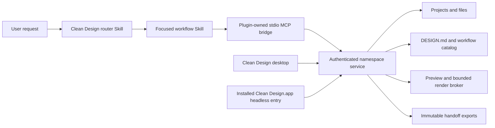

# Clean Design Codex Plugin

**Status:** Approved direction, pending written review
**Date:** 2026-08-17

## Summary

Clean Design will ship a repository-owned Codex plugin named `clean-design`. It follows the same useful separation as the Iterlay integration: bundled Skills define when and how Codex should work, while a bundled MCP server is the source of truth for the visual workspace and performs bounded application operations.

The plugin will be more complete than the current Open Design catalog entry. It will contain a rich Codex manifest, install-surface assets, one routing Skill, seven focused workflow Skills, a self-contained stdio MCP bridge, and a repo marketplace entry. The bridge connects to one authenticated Clean Design service per data namespace and may start that service from an installed `Clean Design.app` without installing a global CLI or opening a visible application window.

MCP is a deterministic application surface, not an agent-hosting surface. It can manage projects, project files, design systems, previews, renders, and handoff exports. It cannot invoke providers, start coding agents, execute arbitrary shell commands, expose arbitrary host paths, or delete projects.

## Product outcome

After installing the plugin, a user can ask Codex to create or refine a website, prototype, presentation, document, design system, brand kit, image, video, or audio project. Codex selects the appropriate bundled Skill, uses Clean Design MCP tools to create or inspect a project, reads the relevant canonical workflow and `DESIGN.md`, edits project files, verifies a preview, and exports a handoff packet when requested.

The plugin must feel native in the Codex plugin browser:

- User-visible name: `Clean Design`.
- Plugin identifier: `clean-design`.
- Developer: `Clean Design`.
- Category: `Creativity`.
- Capabilities: `Interactive` and `Write`.
- Three concise starter prompts.
- Clean Design icon, logo, dark-mode logo, and screenshots.
- Website, privacy-policy, terms-of-service, repository, license, and publisher metadata. For the repo release, the website and repository target the Clean Design GitHub repository, the privacy URL targets `PRIVACY.md`, and the terms URL targets the Apache-2.0 `LICENSE`; the implementation does not invent separate legal terms.
- A useful Skills list rather than a single generic entry.

The first release is installed from this repository marketplace. Submission to the universal public plugin directory is a separate release decision after the repository scrub and acceptance gate.

## Goals

- Replace stale Open Design plugin identity with a first-party Clean Design plugin.
- Package Skills and MCP together, following the Iterlay-style division of responsibilities.
- Make the plugin usable from Codex without requiring a global `od` or `clean-design` command.
- Allow an installed `Clean Design.app` to supply the local service even when its visible UI is closed.
- Make parent agents and subagents share one namespace-scoped service and bounded renderer.
- Preserve local-first storage, trusted-root containment, authenticated IPC, safe credential handling, and immutable handoff behavior.
- Keep the top-level Skill set focused while retaining access to the full canonical Clean Design workflow catalog through MCP.
- Produce stable, actionable errors for missing apps, incompatible versions, capacity limits, unsafe paths, and rendering failures.

## Non-goals

- Publishing to the universal OpenAI plugin directory in this change.
- Restoring Open Design Cloud, accounts, collaboration, billing, deployment, telemetry, automatic updates, or external plugin hosting.
- Installing a global CLI, launch agent, login item, or permanent background daemon.
- Exposing provider credentials or allowing MCP clients to start Clean Design generation agents.
- Exposing arbitrary filesystem, shell, connector, deployment, or network tools.
- Duplicating the complete repository Skill catalog inside the plugin.
- Supporting project deletion or overwrite-in-place exports in the first version.
- Adding custom plugin UI beyond the standard Codex install surface and Clean Design preview outputs.

## OpenAI plugin contract

The implementation follows the current OpenAI plugin packaging model:

- `.codex-plugin/plugin.json` is the required plugin entry point.
- `skills/`, `.mcp.json`, and `assets/` live at the plugin root.
- Manifest paths are relative to the plugin root and start with `./`.
- The repo marketplace lives at `.agents/plugins/marketplace.json` and points to `./plugins/clean-design`.
- Each Skill contains `SKILL.md` and may contain `agents/openai.yaml`, references, scripts, and assets.
- Skill descriptions are concise, front-load their trigger conditions, and state exclusions so implicit invocation remains reliable when descriptions are shortened.
- Each Skill is focused on one job; deterministic application work is delegated to MCP tools.
- The plugin-provided MCP server is declared in `.mcp.json`, so Codex launches it from the installed plugin rather than requiring user-level MCP command configuration.

Primary references:

- [Package your plugin](https://developers.openai.com/plugins/build/plugins)
- [Build skills](https://learn.chatgpt.com/docs/build-skills)
- [Model Context Protocol](https://learn.chatgpt.com/docs/extend/mcp?surface=cli)

## Architecture



### Responsibility split

| Layer | Owns | Does not own |
|---|---|---|
| Plugin manifest | Identity, install copy, starter prompts, assets, component paths | Application behavior |
| Router Skill | Artifact-family selection, task sequencing, capability boundaries | Project state or rendering |
| Focused Skills | Workflow-specific instructions, tool order, verification and completion rules | Canonical workspace data |
| MCP bridge | Stdio protocol, app discovery, attach-or-start, authentication, leases, tool schemas | Databases, rendering, provider calls |
| Clean Design service | Project state, safe file operations, design systems, workflow catalog, previews and exports | Coding-agent reasoning or arbitrary shell access |
| Render broker | Bounded preview/render execution | Agent invocation or unbounded workers |

## Plugin package

The repository will track this package shape:

```text
.agents/plugins/marketplace.json
plugins/clean-design/
  .codex-plugin/plugin.json
  .mcp.json
  README.md
  assets/
    composer-icon.png
    logo.png
    logo-dark.png
    screenshot-create.png
    screenshot-refine.png
    screenshot-export.png
  mcp/
    launcher.bundle.mjs
  skills/
    clean-design/
      SKILL.md
      agents/openai.yaml
    create-web-prototype/
      SKILL.md
      agents/openai.yaml
    create-presentation/
      SKILL.md
      agents/openai.yaml
    create-document/
      SKILL.md
      agents/openai.yaml
    create-design-system/
      SKILL.md
      agents/openai.yaml
    create-brand-kit/
      SKILL.md
      agents/openai.yaml
    create-media/
      SKILL.md
      agents/openai.yaml
    refine-and-export/
      SKILL.md
      agents/openai.yaml
```

The plugin bundle is self-contained. `launcher.bundle.mjs` contains no absolute build-machine paths and uses only plugin-relative resources plus validated discovery of the installed application or current development checkout.

### Manifest presentation

The manifest will include:

- Strict semantic versioning aligned with the compatible Clean Design plugin protocol.
- Short and long descriptions that promise local visual creation, editing, preview, and export without implying hosted services.
- At most three starter prompts, covering a web/prototype project, a presentation, and a brand/document project.
- Clean Design brand color and crop-safe install assets.
- `skills: "./skills/"` and `mcpServers: "./.mcp.json"`.
- No `apps` entry unless a registered remote MCP mapping is deliberately added in the future.
- No hooks in the first release; the plugin should do work only when invoked.

## Skill design

### `clean-design`

The router Skill triggers for requests to create, edit, inspect, preview, render, or export visual projects with Clean Design. It:

1. Confirms that the `clean-design` MCP server is available.
2. Resolves an explicitly named project or uses the active/recent project when unambiguous.
3. Chooses exactly one primary artifact-family Skill.
4. Reads the relevant canonical workflow through MCP when detailed instructions are needed.
5. Requires preview verification before claiming visual completion.
6. Routes final packaging through `refine-and-export`.

It does not duplicate detailed layout, deck, document, media, or export instructions.

### Focused Skills

| Skill | Primary scope | Representative outputs |
|---|---|---|
| `create-web-prototype` | Websites, landing pages, dashboards, product prototypes | HTML/CSS/JS, React projects, responsive previews |
| `create-presentation` | Slide decks and narrative presentations | Bento/HTML decks, PPTX-ready projects, rendered slides |
| `create-document` | Reports, briefs, notes, printable documents | HTML documents, PDF-ready layouts, structured content |
| `create-design-system` | Tokens, components, visual rules, `DESIGN.md` | Design-system projects and reusable guidelines |
| `create-brand-kit` | Brand direction, identity systems, campaigns and social kits | Brand boards, asset families, campaign exports |
| `create-media` | Images, video, audio and mixed-media artifacts | Managed assets, compositions and rendered media |
| `refine-and-export` | Review, compare, correct, render and hand off existing work | Verified previews, immutable handoff packets |

Each Skill defines:

- Precise trigger and exclusion language.
- Required and optional inputs.
- The minimal MCP tool sequence.
- When to inspect existing project state before mutation.
- When a user decision is required.
- Preview and completion checks.
- Stable errors it can recover from.
- Operations that are intentionally unavailable.
- An `agents/openai.yaml` dependency on the specific MCP tools it needs.

The full repository catalog remains accessible through `clean_design_list_skills` and `clean_design_read_skill`. Codex loads a canonical workflow only after the router selects a family or a focused Skill identifies a need, preserving progressive disclosure.

## MCP capability surface

The first version exposes the following namespaced tools.

### Service and workspace

- `clean_design_service_info`
- `clean_design_get_active_project`
- `clean_design_list_projects`
- `clean_design_get_project`
- `clean_design_create_project`
- `clean_design_open_project`

### Project files

- `clean_design_list_files`
- `clean_design_read_file`
- `clean_design_write_file`

Writes are atomic, project-contained, size-bounded, and may accept an expected digest to prevent lost updates.

### Design systems and workflows

- `clean_design_read_design_md`
- `clean_design_list_design_systems`
- `clean_design_read_design_system`
- `clean_design_select_design_system`
- `clean_design_list_skills`
- `clean_design_read_skill`

### Assets, preview, and rendering

- `clean_design_list_assets`
- `clean_design_import_asset`
- `clean_design_preview`
- `clean_design_get_render_status`
- `clean_design_render`
- `clean_design_open_in_app`

Asset import accepts only validated user-selected local inputs or bounded data supplied in the current request. It copies data into managed project storage rather than retaining arbitrary external paths.

### Export

- `clean_design_export_handoff`
- `clean_design_get_export_manifest`

Exports always allocate a new collision-safe destination and never overwrite an existing packet.

### Intentionally unavailable

The MCP profile contains no tool for:

- Starting Codex, Claude Code, Antigravity, OpenCode, Pi, or another agent.
- Invoking a model provider or reading provider credentials.
- Running an arbitrary shell command or executable.
- Reading or writing arbitrary host paths.
- Deleting projects or overwriting existing exports.
- Accounts, collaboration, deployment, billing, telemetry, updates, or external plugin hosting.

The bridge and service assert this allowlist structurally in tests. Unknown capabilities return `TOOL_NOT_AVAILABLE` before reaching an application handler.

## Application discovery and startup

The stdio bridge resolves a protocol-compatible service executable in this order:

1. An explicit `CLEAN_DESIGN_APP_PATH` development override pointing to the current Clean Design checkout or app bundle.
2. `/Applications/Clean Design.app`.
3. `$HOME/Applications/Clean Design.app`.

Every candidate is validated for expected bundle identity, executable type, packaged configuration, and protocol compatibility. Symlink escapes, wrong bundle identifiers, missing resources, and arbitrary executables from `PATH` are rejected.

If no compatible service is running, the startup-lock winner launches the private packaged entry with an argument array, not a shell command. The headless entry does not claim the visible desktop single-instance lock, open a main window, initialize provider execution, or start an agent. It starts the bounded service and render broker only.

The plugin does not depend on `od`, does not add a `clean-design` command to `PATH`, and does not install a permanent service.

## Singleton service and lifecycle

Each Clean Design data namespace has one stable owner-only Unix socket and runtime directory. A namespace is derived from privileged installation and data-root metadata, never from an untrusted project field or TCP port.

Startup uses connect, lock, recheck, then start:

1. Connect to the namespace socket.
2. If unavailable, acquire the atomic namespace startup lock.
3. Recheck after acquiring the lock.
4. Start exactly one service if it remains unavailable.
5. Publish a permission-restricted runtime descriptor only after readiness.
6. Release the lock; losing clients attach with bounded backoff.

Each stdio bridge authenticates, acquires a renewable client lease, and releases it on clean close. Missed heartbeats reclaim leases from crashed clients. The service waits 60 seconds after the final lease and render job before exiting, allowing short-lived Codex subagents to reuse it.

Default production bounds are centralized and not user-raiseable through plugin input:

- 16 simultaneous client leases.
- 2 active MCP application operations.
- 1 active render operation.
- 32 queued operations.
- 3 service starts within 5 minutes before a restart circuit breaker opens.

The desktop application uses a separately authenticated privileged role for existing provider-backed generation. MCP leases receive the deterministic profile only and cannot elevate their role.

## Authentication and secrets

- Runtime directories, sockets, descriptors, and secret files are owner-only.
- Startup generates a random 256-bit secret in a mode-`0600` file.
- Bridge and service perform challenge-response authentication and derive an ephemeral session key.
- Requests bind method, path, body digest, lease, nonce, and expiry to an HMAC signature.
- Nonces are single-use and requests outside the allowed time window fail.
- Provider credentials stay in Electron `safeStorage` and are never copied to the plugin or headless runtime.
- Logs omit credentials, authorization headers, decrypted secrets, prompts, project file contents, and provider headers.

## Data flow

1. The user invokes Clean Design explicitly or asks for a matching visual artifact.
2. The router selects one focused Skill.
3. The Skill resolves the active or named project through MCP.
4. Codex reads existing project state, `DESIGN.md`, and the selected canonical workflow.
5. Codex authors or refines project files through bounded atomic writes.
6. Codex requests a preview or render and waits for terminal status.
7. Codex verifies the returned preview metadata and, when useful, opens the project in the visible Clean Design app for user review.
8. Codex iterates until the requested acceptance criteria pass.
9. On request, Codex creates a new immutable handoff packet and reports its path and manifest.

The service never asks another agent to continue work and never calls a provider on behalf of an MCP client.

## Error model

MCP errors use stable codes and actionable messages:

- `APP_NOT_INSTALLED`: no compatible Clean Design application or development service was found.
- `SERVICE_START_TIMEOUT`: the service did not become ready within the bounded deadline.
- `SERVICE_VERSION_MISMATCH`: plugin and application protocol versions are incompatible.
- `SERVICE_RESTART_BUDGET_EXCEEDED`: crash-loop protection is active.
- `SERVICE_CAPACITY`: a client, operation, render, queue, or memory limit is reached.
- `AUTH_FAILED`: socket or request authentication failed.
- `PROJECT_NOT_FOUND`: the requested project identifier is unknown.
- `CONFLICT`: an expected file digest no longer matches.
- `UNSAFE_PATH`: containment, traversal, symlink, hidden-state, credential, or size policy rejected an input.
- `TOOL_NOT_AVAILABLE`: the requested capability is intentionally absent.
- `RENDER_FAILED`: a preview or render failed without exposing sensitive logs.

Unknown or ambiguous runtime state fails closed and identifies the exact namespace to inspect. Recovery guidance never recommends broad `pkill` or process-group termination.

## Verification strategy

### Manifest and Skill validation

- Validate `plugins/clean-design` with the Codex `plugin-creator` validator.
- Validate every `SKILL.md` and `agents/openai.yaml` against the current Skill schema.
- Assert manifest paths exist, stay within the plugin root, and begin with `./`.
- Assert starter prompts fit documented count and length limits.
- Assert all user-visible strings use Clean Design and contain no stale Open Design or `od` identity.
- Assert the installed package contains no absolute build-machine paths.
- Test representative prompts for correct router and focused-Skill selection.

### MCP unit and contract tests

- Strict input/output schemas and structured content for every tool.
- Read-only, write, and destructive annotations match actual behavior.
- No agent, provider, arbitrary shell, arbitrary path, deletion, or overwrite tool exists.
- Authentication, nonce replay, lease expiry, capacity, and error mapping.
- Project containment, traversal, symlink, hidden-state, credential-name/content, and size policies.
- Atomic writes and digest conflicts.
- Collision-safe immutable exports.

### Integration tests

- Plugin Skill to MCP to project/file/design-system/preview/export flow.
- Source-checkout and packaged-app discovery.
- Visible desktop and headless plugin clients attaching to one namespace service.
- Parent Codex agent and subagents sharing one service and render broker.
- App-open handoff that brings the correct project into Clean Design.
- Clean bridge shutdown, crashed-client lease reclamation, and idle service exit.

### Stress and regression tests

- A 64-client startup storm yields exactly one service and one render broker.
- Capacity saturation returns `SERVICE_CAPACITY` without increasing service or worker counts.
- Three induced crashes open the restart circuit breaker.
- RSS stabilizes under repeated preview and render requests rather than growing without bound.
- Existing desktop, packaged, daemon, export, trusted-root, and handoff tests continue to pass.
- `pnpm guard` and `pnpm typecheck` pass.

## Acceptance criteria

The feature is complete when:

1. Codex displays one repository-installable `Clean Design` plugin with rich metadata, three starter prompts, correct assets, one router Skill, and seven focused Skills.
2. Installing the plugin makes its Skills and MCP tools available in a new Codex task.
3. With the visible app closed, the first MCP call starts one authenticated service from the installed application bundle.
4. Codex can create and refine a project, read `DESIGN.md` and a canonical workflow, preview or render the result, open it in Clean Design, and export an immutable handoff packet.
5. Multiple parent/subagent clients share one service and cannot multiply render workers.
6. MCP cannot invoke an agent or provider, read credentials, execute arbitrary shell commands, access unsafe host paths, delete projects, or overwrite exports.
7. The service exits after the final lease and idle timeout.
8. Plugin validation, focused package tests, security tests, concurrency tests, repository guards, typechecks, and the real packaged-app smoke test pass.

## Delivery sequence

1. Update the product and OpenSpec contracts for the first-party local plugin exception.
2. Add protocol, namespace, authentication, lease, and lifecycle primitives behind tests.
3. Add the bounded MCP application profile and render broker.
4. Build the self-contained stdio bridge and packaged-app discovery.
5. Add the native plugin manifest, assets, eight Skills, and repo marketplace.
6. Validate install-surface rendering and Skill routing.
7. Run application, security, concurrency, packaging, and end-to-end acceptance.
8. Keep public catalog submission out of scope until the release gate is explicitly approved.

## Remaining risks

- Headless Electron rendering still has meaningful memory cost. Singleton startup, one render worker, queue bounds, and memory high-water rejection contain but do not eliminate it.
- A shared service is a single failure domain for attached agents. Stable errors, leases, restart budgets, and exact-namespace recovery keep the failure bounded and diagnosable.
- Eight Skills increase install-surface usefulness but also consume more discovery budget than a single Skill. Concise descriptions, clear exclusions, and MCP-loaded canonical workflows keep the initial context bounded.
- Source and packaged installations can coexist. Strict namespace and executable fingerprinting must prevent accidental cross-attachment.
- The repository intentionally removed broad upstream MCP capabilities. Reuse must be selective so the first-party plugin does not reintroduce arbitrary agent, provider, connector, or filesystem surfaces.
